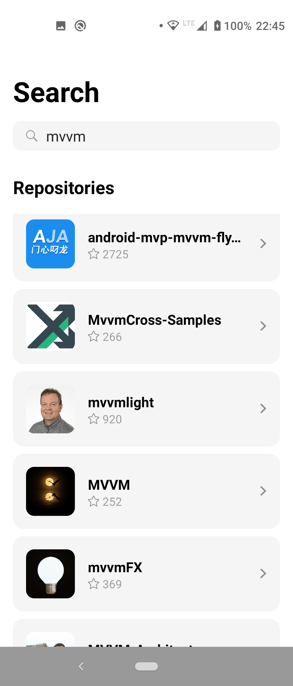
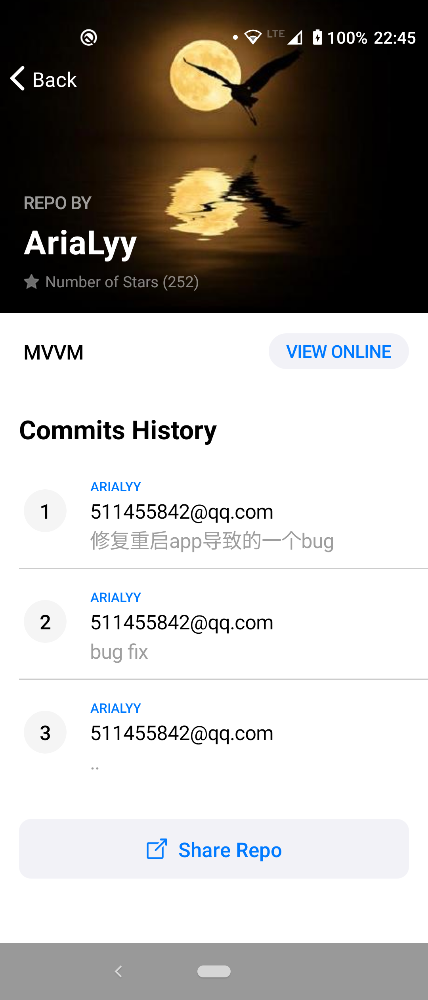

# repo-search-app

 <strong>Functionalities:</strong> 
- searching for Github repositories
- viewing repository details (name, author, last 3 commits)
- viewing repository online
- sharing link to repository

 <strong>Used technologies:</strong> 
- Kotlin Flow
- Kotlin Coroutines
- ViewModel & LiveData
- Data Binding
- Retrofit & Glide
- Hilt

 <strong>App preview:</strong> 

   
  

